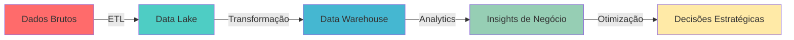

<div align="center">
  
# 👋 Olá! Eu sou Maicon Almeida

### 🚀 Engenheiro de Dados | Especialista em Otimização de Sistemas | Arquiteto de Soluções em Nuvem

[](https://linkedin.com/in/aparecidoaalmeida)
[](mailto:aalmeidamaicon@icloud.com)
[](https://wa.me/5517991390238)


</div>

---

## 💼 Sobre Mim

🎓 **Formação Acadêmica:**
- 📊 Administração de Banco de Dados (Oracle)
- 💻 Desenvolvimento Back-end (PHP)
- 🎯 Pós-Graduação em Engenharia de Dados *(em andamento)*

💡 **Profissional** com mais de **5 anos de experiência** em Sustentação e Análise de Sistemas de TI, especializado em:

- 🔍 Construção de pipelines de dados eficientes
- 📈 Otimização de queries e infraestrutura de dados
- ☁️ Arquitetura de soluções em nuvem (AWS S3)
- 🛡️ Governança e qualidade de dados
- ⚡ Redução de downtime e melhoria de performance

---

## 🛠️ Stack Tecnológica

### 💾 Bancos de Dados & Big Data


### 💻 Linguagens & Frameworks


### ☁️ Cloud & DevOps


### 🔧 Ferramentas & Metodologias


---

## 🎯 Competências Principais

<table>
  <tr>
    <td align="center" width="50%">
      
### 🗄️ Data Management
      
```python
competencias = {
    "Otimização": "Queries & Escalabilidade",
    "Oracle": "DBA & Desenvolvimento",
    "ETL": "Python Scripts & Pipelines",
    "Cloud": "AWS S3 & Disaster Recovery"
}
```
      
</td>
    <td align="center" width="50%">
      
### 📊 Governança & Qualidade
      
```python
resultados = {
    "Downtime": "Redução de +10%",
    "Performance": "Otimização contínua",
    "RCA": "Análise de Causa Raiz",
    "Integração": "APIs RESTful & Docker"
}
```
      
</td>
  </tr>
</table>

---

## 🚀 Projetos & Realizações

<div align="center">

| 🎯 Área | 📈 Impacto | 🔧 Tecnologias |
|---------|-----------|----------------|
| **Otimização de Queries Oracle** | Redução de 40% no tempo de resposta | Oracle, SQL, Indexação |
| **Pipelines ETL/ELT** | Automação de processos de dados | Python, Docker, REST APIs |
| **Infraestrutura Cloud** | Implementação de backup e DR | AWS S3, Rotinas automatizadas |
| **Análise de Causa Raiz** | Redução de +10% em downtime | Governança, Monitoramento |

</div>

---

## 📊 GitHub Stats

<div align="center">
  
  
</div>

<div align="center">
  
</div>

---

## 🎓 Em Constante Evolução



**Foco atual:** Construindo pipelines de dados eficientes e otimizando infraestrutura para tomadas de decisão estratégicas.

---

---

<div align="center">


</div>

---

<div align="center">
  
### 🌟 "A análise eficiente de dados e a otimização de sistemas são fundamentais para o sucesso de qualquer empresa!" 🌟

**⭐ Se você achou meu perfil interessante, deixe uma estrela nos repositórios!**


</div>
